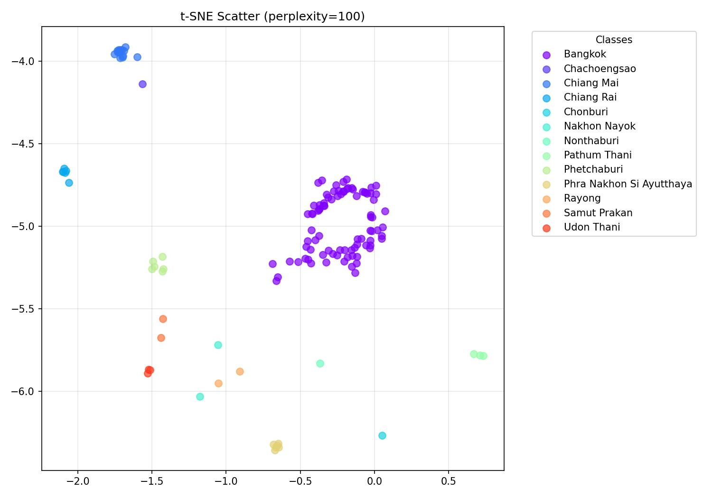

# YOLOv11-tSNE-Visualizer

A visualizer for t-SNE analysis of features extracted from a YOLOv11 model. This project supports extracting features from the YOLOv11 model at the **softmax layer** or **raw logits** using hooks and visualizing the features using **t-SNE**.



---

## Table of Contents
1. [Introduction](#introduction)
2. [Features](#features)
3. [Installation](#installation)
4. [Usage](#usage)
5. [Customizing Colormap](#customizing-colormap)
6. [License](#license)

---

## Introduction

YOLOv11-tSNE-Visualizer is a Python-based tool designed to help you analyze high-dimensional feature spaces extracted from YOLOv11 models. By visualizing features using t-SNE, it provides an intuitive way to understand the clustering of data points corresponding to different classes.

---

## Features

- **Feature Extraction**: Extract features at the softmax layer or raw logits using hooks.
- **t-SNE Visualization**: Dimensionality reduction for visualizing high-dimensional data.
- **Customizable Colormap**: Choose from various colormaps to tailor your scatter plots.
- **High-Quality Exports**: Save your scatter plots as high-resolution JPEG images.

---

## Installation

1. Clone the repository:
   ```bash
   git clone https://github.com/catptype/YOLOv11-tSNE-Visualizer.git
   cd YOLOv11-tSNE-Visualizer
   ```

2. Install the required dependencies:
   ```bash
   pip install -r requirements.txt
   ```

3. Verify your Python environment supports the necessary libraries such as `YOLO`, `torch`, `matplotlib`, `numpy`, and `scikit-learn`.

---

## Usage

1. **Prepare your dataset**:
   Ensure your directory structure follows this format:
   ```
   root/
   ├── class1/
   │   ├── image1.jpg
   │   ├── image2.jpg
   ├── class2/
   │   ├── image3.jpg
   │   ├── image4.jpg
   ```

2. **Run the visualizer**:
   Import the `Yolo11Visualizer` class and pass the paths of your images to visualize t-SNE scatter plots.

   ```python
   from util.Yolo11Visualizer import Yolo11Visualizer

   # Initialize the visualizer with your YOLOv11 model
   visualizer = Yolo11Visualizer("path/to/your/yolov11/model.pt")

   # Visualize using raw logits
   visualizer.visualize_tsne(image_paths=["path/to/image1.jpg", "path/to/image2.jpg"], perplexity=30, logit=True, color='rainbow')

   # Visualize using softmax features
   visualizer.visualize_tsne(image_paths=["path/to/image1.jpg", "path/to/image2.jpg"], perplexity=30, logit=False, color='rainbow')
   ```

3. **Scatter plot output**:
   The scatter plot will be displayed and saved as a high-resolution JPEG file (`scatter_plot.jpg`) in the project directory.

---

## Customizing Colormap

You can customize the colormap used for the scatter plot by specifying a colormap name. Colormap names must match those available in `matplotlib.colormaps`. The default colormap is `rainbow`.

### Available Colormaps

You can use any of the colormaps supported by `matplotlib`. Below are some examples:

- `rainbow` (default): A colorful gradient that works well for distinguishing classes.
- `viridis`: A perceptually uniform colormap suitable for scientific data.
- `plasma`: A smooth gradient with warm colors.
- `cool`: A blue-to-pink gradient.
- `spring`: A gradient with pink and yellow hues.
- `summer`: A green-to-yellow gradient.
- `autumn`: A gradient with warm orange and yellow tones.

For the full list of colormaps, refer to the official [matplotlib documentation](https://matplotlib.org/stable/tutorials/colors/colormaps.html).

---

## License

This project is licensed under the MIT License. See the [LICENSE](LICENSE) file for details.

---